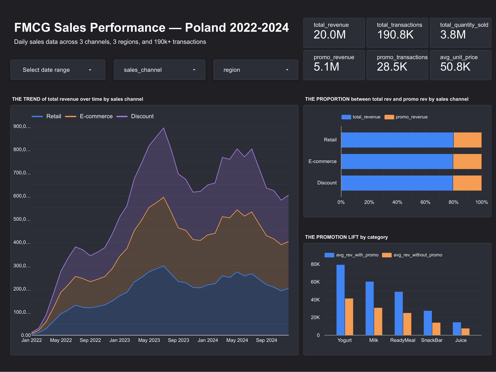

# FMCG Sales Analytics Pipeline

Every day, thousands of transactions flow through a Polish FMCG distributor — milk cartons sold at a discount store in Krakow, energy drinks shipped to an e-commerce warehouse in Warsaw, snack multipacks restocked at a retail chain in Gdansk. Each transaction is a row in a CSV that nobody looks at until quarter-end, when someone asks: *"Why did North region underperform?"*

By then it's too late to act.

This project builds the pipeline that turns those daily CSV dumps into a live dashboard — so the answer is always one click away.

Built for [Data Engineering Zoomcamp 2026](https://github.com/DataTalksClub/data-engineering-zoomcamp).

## The Questions This Pipeline Answers

- **Channel mix:** Retail vs Discount vs E-commerce — which one is actually growing, and where?
- **Promo ROI:** Promotions boost volume, but by how much? And do some categories respond better than others?
- **Seasonal patterns:** When does demand spike? Does it spike the same way across all regions?
- **Delivery health:** Are delivery delays creeping up alongside stockouts?

## The Data

[FMCG Daily Sales Data 2022-2024](https://www.kaggle.com/datasets/beatafaron/fmcg-daily-sales-data-to-2022-2024) — 190k+ daily transactions across 3 sales channels, 3 Polish regions, and dozens of product SKUs spanning categories like dairy, snacks, and beverages. Includes pricing, promotions, stock levels, and delivery lag. CC0 license.

The raw CSV has 14 columns: `date`, `sku`, `brand`, `segment`, `category`, `channel`, `region`, `pack_type`, `price_unit`, `promotion_flag`, `delivery_days`, `stock_available`, `delivered_qty`, `units_sold`.

## How It Works

```
                          Kaggle API
                              |
                         [Airflow DAG]
                              |
          Download CSV -----> Upload to GCS (data lake)
                                    |
                              Load into BigQuery (raw)
                                    |
                              Spark enrichment (local mode)
                              (revenue, date features, flags)
                                    |
                              BigQuery (processed)
                                    |
                              dbt (staging → intermediate → marts)
                                    |
                              BigQuery (analytics)
                                    |
                              Looker Studio dashboard
```

One DAG. Five tasks. Triggered daily. The whole thing runs in Docker — Airflow orchestrates, Spark enriches, dbt shapes it for the dashboard. Spark runs in local mode inside the Airflow worker container using the shaded `spark-bigquery-with-dependencies` JAR to avoid Guava classpath conflicts with BigQuery's connector.

## Tech Stack

| Layer | Tool | Why |
|-------|------|-----|
| Infrastructure | **Terraform** | One `terraform apply` to spin up everything on GCP |
| Containers | **Docker Compose** | 8 services: Airflow cluster (webserver, scheduler, worker, init, Postgres, Redis) + Spark (master, worker) |
| Package management | **uv** | Faster Python dependency installs inside Docker images |
| Orchestration | **Airflow** (CeleryExecutor) | DAG chains 5 tasks with retries and logging |
| Data Lake | **GCS** | Raw CSV lands here before anything else |
| Warehouse | **BigQuery** | 3 datasets: `fmcg_raw`, `fmcg_processed`, `fmcg_analytics` |
| Batch Processing | **Spark** (PySpark 3.5) | Computes revenue, extracts date features, casts types |
| Transformations | **dbt** | Staging views, intermediate aggregates, partitioned mart tables with tests |
| Dashboard | **Looker Studio** | Connected directly to the analytics dataset |

## Project Structure

```
.
├── .env.example            # template — copy to .env and fill in your secrets
├── Makefile                 # shortcuts: make setup, make infra-up, make docker-up
├── terraform/               # IaC: GCS bucket + 3 BigQuery datasets
├── docker/
│   └── docker-compose.yml   # 8 services (Airflow cluster + Spark cluster)
├── airflow/
│   ├── Dockerfile           # custom image with Java, uv, all Python deps
│   ├── dags/
│   │   └── fmcg_pipeline_dag.py   # the single DAG — 5 tasks in sequence
│   └── scripts/
│       ├── download_dataset.py    # Kaggle API download + unzip
│       ├── upload_to_gcs.py       # upload CSVs to GCS data lake
│       ├── gcs_to_bigquery.py     # load main CSV into BigQuery raw table
│       └── run_spark_job.py       # spark-submit with shaded BQ connector
├── spark/
│   ├── Dockerfile
│   └── jobs/
│       └── transform_sales.py     # PySpark: revenue calc, date features, type casts
├── dbt/
│   ├── dbt_project.yml
│   ├── profiles.yml               # BigQuery connection (uses env vars)
│   ├── packages.yml               # dbt_utils for surrogate keys
│   └── models/
│       ├── staging/               # stg_fmcg_sales: clean, rename, cast, add surrogate key
│       ├── intermediate/          # daily channel aggregates + promo effectiveness
│       └── marts/                 # fct_sales_summary, fct_promotion_impact, dim_product, dim_calendar
├── dashboards/
│   └── screenshots/
│       └── dashboard.png
└── credentials/                   # gitignored — your GCP service account key goes here
```

## Why Partition and Cluster This Way

Every question the dashboard answers starts with *"in what time period?"* — so partitioning `fct_sales_summary` by `sale_date` (monthly granularity) lets BigQuery skip months you're not looking at. Monthly gives us 36 partitions across 3 years, which is a sweet spot — daily would create 1,095 partitions for a table with only ~10k rows, which is overkill.

After date, the next thing people filter on is channel and region. Clustering by `sales_channel, region` means BigQuery can jump straight to the relevant data blocks instead of scanning the full partition.

`fct_promotion_impact` is partitioned by `report_month` and clustered by `category, sales_channel` — because the promotion analysis always drills into specific categories.

The processed table (Spark output) doesn't have BigQuery-level partitioning since it's overwritten on each run, but dbt reads from it efficiently via views.

## Dashboard



| Tile | Chart Type | What it shows |
|------|-----------|---------------|
| **Scorecards** (top) | KPI numbers | 20M total revenue, 190.8K transactions, 3.8M units sold, 5.1M promo revenue, 28.5K promo transactions, 50.8K avg unit price |
| **THE TREND** (left) | Stacked area | Revenue over 3 years by channel. Discount (purple) dominates, clear summer peaks in May-Jul, 2023 was the highest year. |
| **THE PROPORTION** (top right) | 100% stacked bar | Promo revenue share by channel. ~20-25% across all three — Discount slightly higher. |
| **THE PROMOTION LIFT** (bottom right) | Grouped bar | Avg revenue with vs without promo by category. Yogurt shows the biggest lift. Juice barely responds. |

Interactive filters at the top: date range, sales channel, region.

Key insight from the data: Yogurt promotions generate nearly 2x the revenue compared to non-promo periods, while Juice promotions have almost no effect. If you had to cut promo budget somewhere, Juice is the obvious candidate.

## Reproduce It Yourself

### You'll need

- A GCP account (with billing enabled)
- Docker and Docker Compose
- Terraform
- A Kaggle account (for the API key)

### 1. Clone and configure

```bash
git clone https://github.com/McCallan1996/fmcg-sales-pipeline.git
cd fmcg-sales-pipeline
cp .env.example .env
```

Open `.env` and fill in:
- `GCP_PROJECT_ID` — your GCP project ID
- `GCS_BUCKET_NAME` — will be `YOUR_PROJECT_ID-fmcg-data-lake` after Terraform runs
- `KAGGLE_USERNAME` / `KAGGLE_KEY` — from kaggle.com > Account > Create New Token (download `kaggle.json`, copy the username and key values)
- `AIRFLOW__CORE__FERNET_KEY` — generate one by running: `python -c "from cryptography.fernet import Fernet; print(Fernet.generate_key().decode())"`

### 2. Set up GCP

1. Create a GCP project (or use an existing one)
2. Enable the **BigQuery API** and **Cloud Storage API**
3. Create a service account with **BigQuery Admin** and **Storage Admin** roles
4. Download the JSON key and save it as `credentials/google_credentials.json`

### 3. Provision infrastructure

```bash
cd terraform
terraform init
terraform apply -var="project_id=YOUR_PROJECT_ID"
```

This creates one GCS bucket and three BigQuery datasets (`fmcg_raw`, `fmcg_processed`, `fmcg_analytics`). Note the bucket name in the output — put it in your `.env`.

### 4. Start the stack

```bash
cd ../docker
docker compose --env-file ../.env up -d
```

Give it about a minute to boot. The first time takes longer because Docker builds the Airflow and Spark images. Airflow UI will be at http://localhost:8080 — login with `admin` / `admin`.

### 5. Run the pipeline

Find `fmcg_daily_sales_pipeline` in the Airflow UI. Unpause it. Hit the play button. Watch the five tasks turn green one by one:

1. **download_from_kaggle** — pulls the dataset from Kaggle (~4 MB, unzips to 3 CSVs)
2. **upload_to_gcs** — uploads all CSVs to the GCS data lake
3. **load_to_bigquery_raw** — loads `FMCG_2022_2024.csv` (the main file, 190k rows) into BigQuery
4. **spark_transform** — reads from BigQuery, adds revenue/date features/weekend flag, writes back to BigQuery
5. **run_dbt** — installs dbt packages, builds 3 staging/intermediate views + 4 mart tables, runs 11 data tests

The whole pipeline takes about 2 minutes.

### 6. Build the dashboard

Open [Looker Studio](https://lookerstudio.google.com), create a new report, and add BigQuery as a data source:
- Connect to `YOUR_PROJECT > fmcg_analytics > fct_sales_summary` for the trend chart, proportion chart, and scorecards
- Add a second data source: `fct_promotion_impact` for the promotion lift chart

### Teardown

```bash
cd docker && docker compose down -v
cd ../terraform && terraform destroy -var="project_id=YOUR_PROJECT_ID"
```

## What I Learned

The hardest part wasn't any single tool — it was getting them to talk to each other. Spark's BigQuery connector has a Guava version conflict that took me a while to debug (the fix: use the shaded `spark-bigquery-with-dependencies` JAR instead of the regular one). The Airflow Celery worker crashed silently because of a hostname issue I only found by digging through container logs. And dbt's `packages-install-path` didn't play well with Docker volume mounts on Windows until I moved it to `/tmp`.

The dataset itself had a surprise too — it ships with 3 CSV files that have different schemas (14, 24, and 33 columns). Loading them all with a `*.csv` wildcard into one BigQuery table just fails silently with a "too many values" error. Had to target just the main file.

On the analysis side, the most interesting finding was the promotion lift chart. I expected promotions to help across the board, but Juice barely responds while Yogurt nearly doubles. If this were a real company, that's a concrete recommendation: shift promo spend from Juice to Yogurt.

None of that shows up in the final DAG. It just runs. But those are the things that taught me the most.
